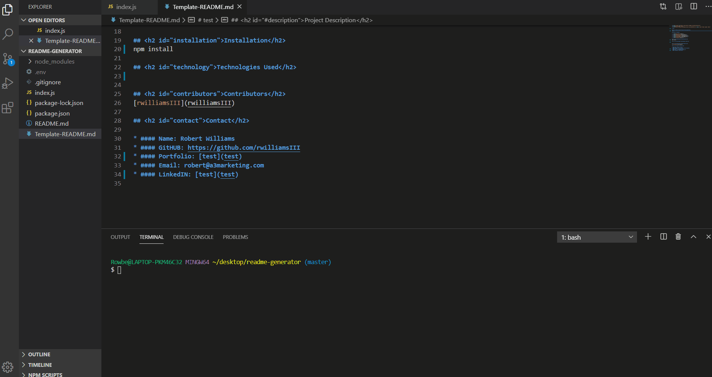

 

# ReadME generator

## <h2 id="#description">Project Description</h2>
Generates a readme template based on user input.

## Table of Contents

* <a href="#license">License</a>
* <a href="#description">Description</a>
* <a href="#installation">Installation</a>
* <a href="#technology">Technologies Used</a>
* <a href="#contributors">Contributors</a>
* <a href="#contact">Contact</a>

## <h2 id="installation">Installation</h2>
Clone the repo on to your local machine and run an "npm install" in the terminal to download necessary modules. Once everything is installed, return to github and register for a key with user access(this can be accomplished by going to your user settings on github and clicking the develop tag). You will place this key in a ".env" file like so[GH_Key=YOURKEYGOESHERE]. Once that is completed go back in to the terminal and type in "node index.js" and press enter. After you press enter a series of questions will appear in the terminal. Answering all the questions will generate a ReadME.md file based on the criteria you entered.

## <h2 id="example">Application Example</h2>

    
## <h2 id="technology">Technologies Used</h2>
Javascript,Node.JS,GitHUB

## <h2 id="contributors">Contributors</h2>
[rwilliamsIII](rwilliamsIII)

## <h2 id="contact">Contact</h2>

* #### Name: Robert Williams
* #### GitHUB: https://github.com/rwilliamsIII
* #### Portfolio: [n/a](n/a)
* #### Email: robert@a3marketing.com
* #### LinkedIN: [https://www.linkedin.com/in/robertwilliams2715/](https://www.linkedin.com/in/robertwilliams2715/)
